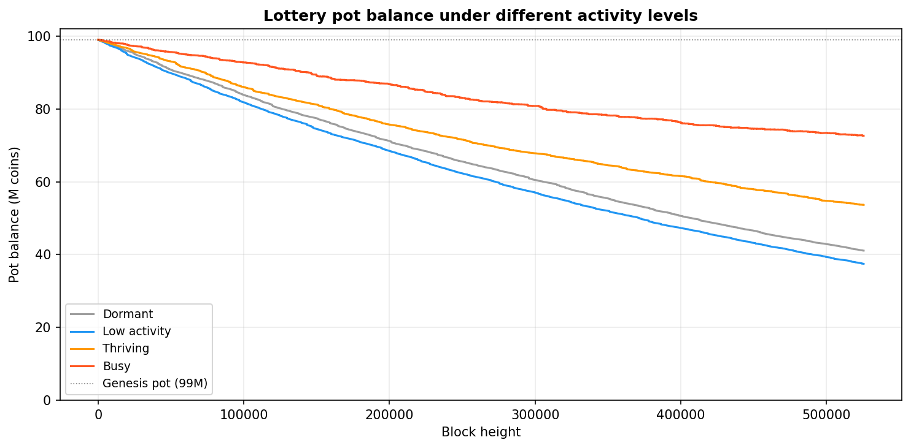
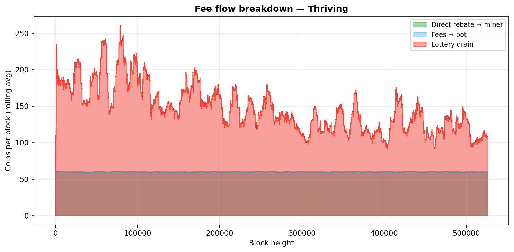
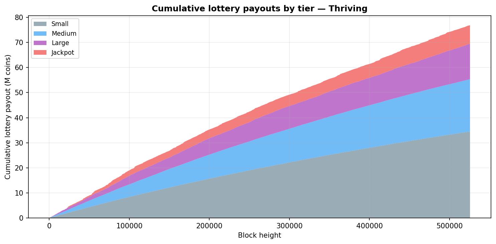

# Lootcoin Economics

This document explains how Lootcoin's economic parameters interact over time: the lottery pot, coin supply, inflation, and the incentive effects of different network activity levels. All charts were generated by [`simulate_economy.py`](simulate_economy.py) using 525,600 blocks (1 year at 60 s/block).

---

## Economic model at a glance

| Parameter | Value |
|---|---|
| Genesis supply | 100,000,000 coins (1M circulating + 99M in pot) |
| Coinbase reward | 1 coin per block |
| Min transaction fee | 2 coins |
| Fee split | 50% → miner directly, 50% → lottery pot |
| Ticket window | Every block with ≥1 transaction earns a lottery ticket |
| Settlement | `created_height + 100` (uses 100 block hashes as entropy) |
| Inflation | ~0.523%/year (coinbase only; asymptotically approaches 0) |

---

## Supply and inflation

Lootcoin has a fixed coinbase reward of **1 coin per block** regardless of activity. With a genesis supply of 100M coins this produces a starting inflation rate of ~0.523%/year, declining asymptotically as supply grows. The rate is independent of transaction volume — fees do not create new supply, they circulate within the existing stock.

At 60 seconds per block and 525,600 blocks per year, total supply grows by roughly 525,600 coins per year. After 10 years the annual inflation rate falls below 0.48%. After 100 years it is below 0.05%.

---

## Lottery pot dynamics

The pot is seeded at genesis with **99,000,000 coins** and replenished by 50% of every transaction fee. Payouts are a flat fraction of the current pot, so the pot never fully drains (asymptotic decay). Instead, it trends toward an equilibrium determined by network activity:

```
pot_equilibrium ≈ 0.50 × avg_fee × avg_txs_per_block / Σ(prob_i / divisor_i)
                ≈ 0.50 × 2 × avg_txs × 438,000
```

With full blocks (240 txs) this equilibrium is ~105M coins. With half-full blocks (~120 txs) it is ~52M. The pot converges to its equilibrium from whatever level it starts at.



Key observations over 1 year:
- **Dormant (2 txs/block)**: The pot drains from 99M to ~41M. Lottery payouts far exceed fee income at this level, funded by the genesis endowment. The pot still has decades of runway.
- **Low activity (8 txs/block)**: Drains to ~37M — fee income is higher but so is win frequency since every block earns a ticket.
- **Thriving (60 txs/block)**: Settles near 54M; fee replenishment meaningfully offsets payouts.
- **Busy (120 txs/block)**: Drains only to ~73M; fee income covers ~71% of lottery outflows.

In all scenarios the pot remains substantial after one year, and converges toward a long-run equilibrium once fee income matches expected payouts.

---

## Fee flow

Every block's transaction fees are split in two:

1. **50% → miner directly** — immediate income for including transactions
2. **50% → lottery pot** — deferred income, distributed probabilistically via lottery tickets

This chart shows the three coin flows for the "Thriving" scenario (rolling average):



- **Direct rebate** (green): steady, proportional to transaction volume
- **Fees to pot** (blue): mirrors the rebate; both sides receive the same amount
- **Lottery drain** (red): bursty — quiet for most blocks, then a spike when a ticket wins

The lottery drain is dominated by **small** wins (36.25% probability, every ~3 blocks), with medium, large, and jackpot wins appearing as larger spikes at lower frequencies.

---

## Lottery payouts by tier

Each ticket is settled with a single probabilistic draw against the pot at settlement time. Payouts are a flat fraction of the pot — independent of how many transactions were in the block:

| Tier | Probability | Payout formula | Expected frequency | Expected payout at 99M pot |
|---|---|---|---|---|
| No-win | 62.00% | — | — | — |
| Small | 36.25% | `pot / 400,000` | ~every 3 blocks | ~247 coins |
| Medium | 1.67% | `pot / 30,000` | ~every 60 blocks (~1 h) | ~3,300 coins |
| Large | 0.07% | `pot / 2,000` | ~every 1,440 blocks (~1 day) | ~49,500 coins |
| Jackpot | 0.01% | `pot / 500` | ~every 10,080 blocks (~1 week) | ~198,000 coins |

This chart shows cumulative lottery payouts by tier over 1 year (thriving scenario):



Small wins dominate aggregate payout volume because they are ~3,600× more frequent than jackpots. The jackpot's outsized individual reward is what makes it exciting; its low expected value per ticket is the price of that excitement.

---

## Miner income breakdown

At different activity levels, the proportion of miner income from fees vs lottery changes substantially. Over 1 year (525,600 blocks):

| Scenario | Avg txs/block | Direct fee rebate | Lottery winnings | Total miner income |
|---|---|---|---|---|
| Dormant | 2 | 1.1M coins | 59.0M coins | 60.0M coins |
| Low activity | 8 | 4.2M coins | 65.7M coins | 69.9M coins |
| Thriving | 60 | 31.5M coins | 76.9M coins | 108.4M coins |
| Busy | 120 | 63.1M coins | 89.4M coins | 152.5M coins |

Across all scenarios, the lottery contributes the majority of miner income. As the network grows more active, fee income increases — but the pot also stays larger, making each win more valuable.

---

## Regenerating the charts

```bash
# Requires: pip install matplotlib
python simulate_economy.py --save-dir docs/charts --blocks 525600
```

To explore a single scenario interactively:

```bash
python simulate_economy.py --scenario thriving --blocks 525600
```
